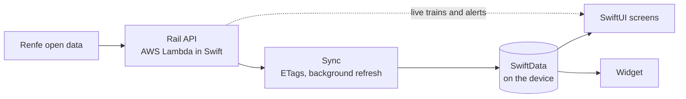

# Rail

Offline-first iOS app with the timetables of **Cercanías Málaga**, the Renfe commuter rail network in Málaga. Native Swift and SwiftUI, no third-party dependencies.

Built for the [ACoding Hackathon 2026](https://acoding.academy/hackaton26/) by Apple Coding Academy.

## Demo

## Why

We, Juan Salguero ([@jsalgueroibarrola](https://github.com/jsalgueroibarrola)) and Desirée Rodríguez ([@Sukiarts](https://github.com/Sukiarts)), both ride Cercanías, and the official app doesn't fit how we use it or what we expect from it:

- **No offline mode.** At a station without coverage you can no longer see the timetable.
- **Station screens often don't work**, so there's no fallback there either.
- **When Renfe's servers are slow or down, the timetable disappears too**, even though it hardly ever changes apart from delays or problems on the line.
- **It isn't a native app**, and it has other UX problems.

Rail downloads the network and the timetable once, stores them on the device and serves every screen from that local copy, so timetables are always available. Live train positions and service alerts are shown on top whenever there's a connection.

## Features

- **Next trains.** Home shows the next departures from the station nearest to you, or from the one you pick when location is off, plus your favorite stations.
- **Journeys.** Search trips between two stations, direct or with one transfer, and come back to recent searches.
- **Map.** The whole network, the stations near you and the trains moving along their lines in real time.
- **Stations.** Every station, filtered by line or searched by name, with the nearest ones first. Each station shows its next departures, the full timetable, how long it takes you to get there on foot, by bike, by car or by public transport, accessibility, connections and directions in Apple Maps.
- **Service alerts.** Renfe's incidents, which you can translate on the device when your iPhone isn't in Spanish.
- **Widget.** The next trains of a favorite station on the Home Screen, in small, medium and large sizes.
- **Works offline.** The timetable lives on the device; the app refreshes it in the background when there's a connection.
- **Onboarding** that explains the app, asks for location with context and helps pick favorite stations.
- Spanish and English, light and dark mode, and Dynamic Type.

## Devices

Rail is designed for **iPhone**. It also runs on iPad, and we did our best to make it look good there, but the layout is basically the iPhone one, centered on the screen: we would have liked to make better use of the extra space, but we ran out of hackathon time. 😅

## Scope

Because of the hackathon's time limit, and because the app started from our own everyday use, the scope is only **Cercanías Málaga**.

## Architecture

The app follows a layered architecture: the network and the timetable are synced from the API into SwiftData, and every screen reads from that local store. Live data (train positions and alerts) is only polled while it is on screen. The widget reads the same store through an App Group.

| Folder | Responsibility |
|---|---|
| `Rail/Rail/App/` | Composition root: builds the dependencies and the SwiftData container (shared with the widget), and exposes services to the views through the SwiftUI environment. |
| `Rail/Rail/Network/` | HTTP client: GET and decode, ETags (`If-None-Match`) and the API endpoints. |
| `Rail/Rail/Service/` | API, sync, live feed, location, connectivity and route-estimate services, plus the DTOs that mirror the API payloads. |
| `Rail/Rail/Sync/` | Sync actor, the data freshness policy (when data must be downloaded before showing anything and when it can refresh in the background), polling intervals and the merge of live train updates. |
| `Rail/Rail/Model/` | SwiftData models: network, lines, stations, timetable, trips, live trains, alerts and the user's favorites. |
| `Rail/Rail/Domain/` | Pure schedule logic with no UI: next trains, station timetables and journeys with transfers. |
| `Rail/Rail/Repository/` | Reads and writes to SwiftData, split by who observes the data: background actors for sync and schedules, main actor for user data. |
| `Rail/Rail/ViewModel/` | App lifecycle (checking, loading, ready, failed), location, favorites and recent journeys. |
| `Rail/Rail/View/` | One folder per screen (`Home`, `Map`, `StationDetail`, `Onboarding`, `Sheets`…), reusable `Components` organized as atoms, molecules and organisms, and `Presentation` with the pure builders and formatters the views draw from. |
| `Rail/Rail/DesignSystem/` | Design tokens: spacing, radius, sizes, typography, elevation and line colors. Colors live in `Assets.xcassets` with light and dark variants. |
| `Rail/RailWidgets/` | Widget extension with the next trains of a favorite station, configurable with App Intents. |

Built with SwiftUI, SwiftData, MapKit, WidgetKit, App Intents, Core Location, Translation and Swift Concurrency in Swift 6 language mode. [`Rail/CLAUDE.md`](Rail/CLAUDE.md) goes deeper into the architecture and the conventions we followed.

## API

The app doesn't read Renfe's datasets directly. We built an API as a workaround to make the data easier for the app to consume: a set of **AWS Lambda functions written in Swift**, deployed to AWS. It lives in a separate project that isn't on GitHub yet; we didn't have time to publish it during the hackathon, but we may do so in the future.

- **Swift on both sides.** The backend uses the same language as the app. Each endpoint is its own small Lambda, so each one only carries what it needs.
- **The network is built in.** Lines and stations barely change, so they ship inside the Lambda and are returned instantly.
- **The timetable is prepared once a day.** Renfe publishes it as a large ZIP file, and processing it on every request would be slow and expensive. A scheduled job processes it every morning, before the first train, and the app just downloads the result.
- **Live data with a short cache.** Train positions and alerts change every few seconds, so they're read from Renfe and cached briefly.
- **A CDN in front.** CloudFront groups the requests from every user, so Renfe is called once per cache window instead of once per user. With ETags, checking an unchanged timetable costs almost nothing.
- **Fully serverless.** No servers running all the time: it only costs money when it's used.

For the days it has been running, with our own use of the app, the API has cost **one cent in total** (before taxes).

## Data

Thanks to Renfe for publishing the open datasets on [data.renfe.com](https://data.renfe.com) that made this app possible.

Data source: Renfe Operadora.

Rail is an independent project and is not affiliated with, sponsored by or endorsed by Renfe.

## Running it

Open `Rail/Rail.xcodeproj` in Xcode 27 and run the `Rail` scheme. The app requires iOS 26 or later.

The API address is already set in the `RAIL_API_BASE_URL` build setting, so the app works as is. The first launch needs a connection to download the network and the timetable; after that, it works offline.

## License

The code is under the [PolyForm Noncommercial License 1.0.0](LICENSE.md): you can use, study, modify and share it for any noncommercial purpose, but not for commercial use. Renfe's data keeps its own terms of use.
